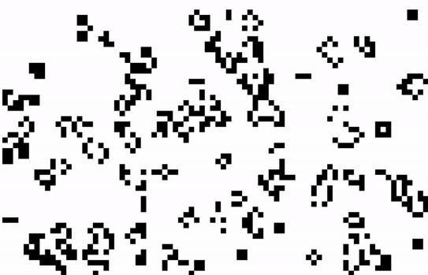

This is an illustration of Conways Game of life. Implemented using Javascript

The Game of Life, is a cellular automaton devised by the British mathematician John Horton Conway in 1970. It is a zero-player game, meaning that its evolution is determined by its initial state. One interacts with the Game of Life by creating an initial configuration and observing how it evolves.

